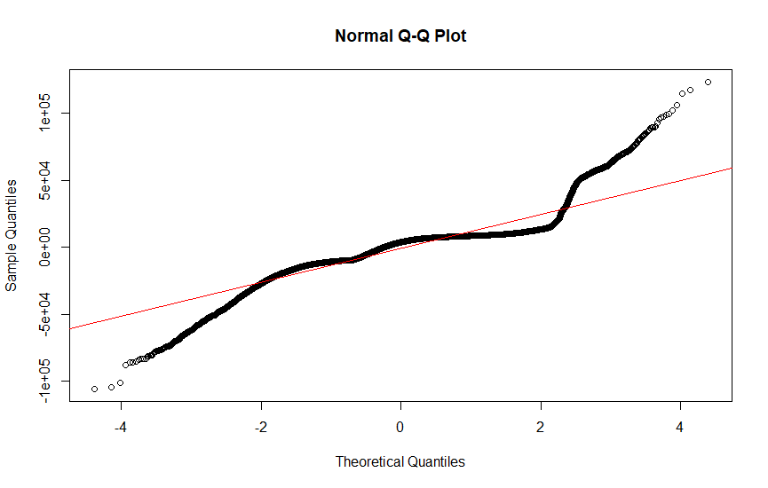

## Abstract

This study looks into how an employee’s total benefits received is related to the their total salary. Data regarding the total compensation of different employees was studied using employee data from the City of San Francisco in the year of 2024. The objective was to identify any correlation between employees’ salary and the benefits that they received. For many employees on the market for a job, this is an important question because benefits make up a significant portion of overall compensation thus would reveal how much an employer values them. Methods utilized included building a linear regression model, running a hypothesis test, as well as utilizing a scatterplot. Results from our hypothesis test concluded that the amount of benefits an employee receives is strongly correlated to the total salary they receive.

## Introduction

The amount of compensation employees obtain is crucial when it comes to workplace dynamics as well as employee retention. How well an employee is compensated is also directly related to how satisfied they are with their job. However, compensation is not just about the base salary an employee obtains. Benefits, such as health insurance, retirement, and other benefits are also a major factor when it comes to their compensation. Understanding how benefits are related to salary would provide employees with another insight into pay structure. When deciding on a job offer, many prospective employees focus primarily on the salary as the key factor in evaluating the offer. Most job posts would also list a range for the salary, while completely leaving out details on benefits received. From a perspective employee's point of view, understanding the relation would give useful insight when evaluating offers. One would expect that the higher salary an employee receives, the greater benefits they receive, simply because the higher salary would show that their labor is valued more by the employer.

Understanding the relationship between total salary and total benefits would also reveal how corporations allocate resources across employees of different roles. If we conclude that benefits and salary are not correlated with each other, it would show that the benefits corporations give to their employees are not determined by their role in the company, since the role determines salary. In contrast, if the amount of benefits an employee obtains is dependent on the total salary they receive and there is a positive correlation, this would point to the fact that organizations not only give more salary to employees of certain levels or roles through their salary, but the recognition is reflected in their benefits as well. This paper addresses this gap by providing statistical insight on whether employees who receive a higher salary also receive more benefits.

To help us look into the question, we pulled a dataset, Employee Compensation, from DataSF. The dataset provides details on different salaries adding up to a total salary and different benefits adding up to total benefits on numerous amounts of employees for the City of San Francisco.

The Data section gives further details on the data that was utilized, statistical methods utilized are listed in the Methods section, our statistical findings are listed in the Results section, and our conclusions from the study can be found in the Discussion section.

## Data

The dataset we utilized, Employee Compensation [@SF_Compensation_Data], from the Open Data Portal on municipal website of San Francisco provides data on the salary and benefits of city employees since the fiscal year of 2013. There are a total of 1.05 million data points in this dataset, where each row reflects a city employee. Variables that were relevant to our study included Total.Salary, which was each employee's annual salary and Total.Benefits, which was each employee's benefits in monetary value. To allow numerical computations, all commas were removed from the data. The data is obtained through the San Francisco Controllers Office where they have a database of all salary and benefits of city employees. To avoid dependence as many employees may be hired by the city in multiple years, we focused on the year of 2024, the most recent, which contains 86698 employees.

```{r}
#| echo: false
#| message: false
#| warning: false
library(dplyr)
library(knitr)
compensation <- read.csv("Employee_Compensation_20250829.csv")
#remove na
compensation <- na.omit(compensation)
#drop rows with missing values
compensation <- compensation[complete.cases(compensation[, c("Total.Benefits", "Total.Compensation")]), ]
#deal with commas (e.g. 1,000 = 1000)
compensation$Total.Benefits <- as.numeric(gsub(",", "", compensation$Total.Benefits))
compensation$Total.Salary <- as.numeric(gsub(",", "", compensation$Total.Salary))
compensation <- subset(compensation, Year==2024) # focus on year 2024
compensation %>%
  summarise(
    Mean_Salary   = mean(Total.Salary, na.rm = TRUE),
    Salary_SD     = sd(Total.Salary, na.rm = TRUE),
    Min_Salary    = min(Total.Salary, na.rm = TRUE),
    Max_Salary    = max(Total.Salary, na.rm = TRUE),
    Mean_Benefits = mean(Total.Benefits, na.rm = TRUE),
    Benefits_SD   = sd(Total.Benefits, na.rm = TRUE),
    Min_Benefits  = min(Total.Benefits, na.rm = TRUE),
    Max_Benefits  = max(Total.Benefits, na.rm = TRUE)
  ) %>%
  t() %>%
  kable(col.names = c("Value"))
```

## Methods

A linear regression model was fitted based on the dataset using the lm() function in R [@RLanguage]. A scatterplot depicting the independent and dependent variables was also generated using the ggplot package [@ggplot2].

$$
Y_{i} = \beta_{0} + \beta_{1}X_{i} + \epsilon_{i}
$$

In our regression model, the total salary that each employee, i, received is represented as the independent variable (X), and the dependent variable (Y) was the total benefits each employee received.$\beta_0$ is the intercept, $\beta_1$ is the slope, and $\epsilon_i$ is the residual error.

Analyzing the model and the estimated slope would show us whether or not there is a correlation between the dependent and independent variables. A limitation we have, however is that we are not able to conclude causation between the two variables. For example, the department a that city employee works in could simply pay higher and give more benefits than other departments. In that sense, the benefits received is not caused by the total salary received, but is caused by the department the employee works in. Another example would include that some city workers are unionized, which would increase both their salary and benefits. In that sense, the benefits they receive is not caused by their salary, but their union membership. Furthermore, our dataset only contains a employees of the City of San Francisco. Trends may very likely differ if we look at data in another city or a private organization, a confounding variable.

We also looked into the assumptions of the linear regression model on whether or not the relationship we have between our dependent and independent variables is linear and the residuals have constant variance, are independent, and are normally distributed.

## Results

We have a null hypothesis, $H_{0}$, assuming that $\beta_{1}$, the slope, was equal to 0, indicating no relationship between the salary earned and the total benefits received. Our alternative hypothesis, $H_{a}$, would conclude that $\beta_{1}$, the slope, was not equal to 0, indicating that the total benefits received was related to the salary of an employee. To make a conclusion, we ran a t-test on the slope parameter in our regression model with a test size of 0.05. The test statistic that we utilized was our t-value: $$t = \frac{b_{1} - 0}{SE(b_{1})}$$

The model estimated a slope. $b_1$ of 0.269 for the salary variable with p-value of less than $2 * 10^{-16}$. Based on the p-value being less than our test size of 0.05, we reject the null hypothesis and conclude there is a relationship between the two variables. Our $R^2$ value of 0.7594 also indicates that total salary explains a lot of the variability in the total compensation received. The estimated slope, $b_{1}$ shows that for every extra dollar of salary an employee gets, they get about \$0.27 in benefits.

{fig-align="center"}

To analyze whether or not our model follows the assumption that the regression function is linear and the residuals have equal variance, are independent, and are normally distributed, we examine the residual vs. predictor plot, residual vs. time plot, and the QQ plot.


Upon examining the residual vs predictor plot, we can see a funnel shape as the salary increases. This shows that there is a higher variance among higher salaries and that the residuals are not of constant variance. However, there is no "u-shape" or "wave" that would indicate a non-linear relationship.


Upon examining a plot of the residuals versus the time, we can see that the residuals vary a significant amount. For example, the variation is higher between 2014 to 2016 as compared to between 2022 and 2024. This indicates a non-constant variance among the residuals.



Upon examining the Q-Q, or Quantile-Quantile, plot, we can clearly see that the distribution of residuals has heavier tails on the right and left tails. Thus, we conclude our residuals are not normally distributed. However, due to our large sample size of 1053380, normality would not have much of an effect.

## Discussion

We analyzed the total annual salary and total benefit value of 1.05 million employees working for the City of San Francisco. We considered the total salary to be the independent variable and the total benefit value to be our response variable when fitting our regression model.

Analyzing our model, we found an estimated slope of 0.269 for our total annual salary. We considered a null hypothesis where there is no relation between our dependent and independent variables. In our case, our null hypothesis would be concluding that the amount of annual salary an employee gets has no relation to the benefits they receive. Considering a two-sided t-test with a test size of 0.05, we observed a p-value that is significantly lower than 0.05, thus we reject the null hypothesis and conclude that our variables are related with a positive correlation. A high $R^2$, shows that variance within the benefits received is explained by the salary received, especially in a large sample size of 1.05 million city employees.

However, this research has limitations in the sense of causal relationships. Although we can clearly see that total benefits an employee receives is positively correlated with the total annual salary they receive, we cannot say a high salary "causes" a high amount of benefits. As mentioned above, a particular department an employee works for could have significantly more funding. Should an employee work for that particular department, they would have higher annual salary and benefits received. Many city employees are members of unions. Unions would generally negotiate better pay and benefits for their members. Lastly, our data focuses on employees who work for the city of San Francisco. Trends that we see here may not be applicable for employees who work for other cities or non-governmental workers.

Another limitation comes with that fact that different departments may calculate benefits very differently. Our model assumes that the relationship between salary and benefits is consistent across all employees. This brings up the issue that a single global linear model may not accurately capture patterns that differ across departments. However, different departments were included to address the issue of our data being representative as we do not wish to overfit on one department.

Furthermore, by looking into the residual vs. predictor, residual vs. time, and Q-Q plots, we can conclude that our assumptions on equal variance, independence, and normality on the residuals have all been violated. Due to a large sample size, the violation on normality would not have a significant effect. However, non-equal variance and dependent residuals could make our confidence intervals and standard errors off, requiring us to take our hypothesis test with a grain of salt. We could have very well falsely rejected our null hypothesis.

To make our findings more conclusive, instead of using a simple linear regression model where we only consider one predictor variable, the total salary received, we could utilize a multiple linear regression model where we have multiple predictor variables. Variables we mentioned above (e.g. union membership and department) could be one-hot encoded and included as additional predictor variables. The data on the estimated slopes of these predictor variables could be used to determine which predictor variable is more highly correlated with our response variable, the total benefits received. In addition, we could look into data on compensation from other cities or private organizations to get a sample that is more representative and is not limited to employees for the city of San Francisco. To address non-constant variances among the residuals and them not being independent, we could introduce variable transformations in order to make our hypothesis tests more reliable.

## References
